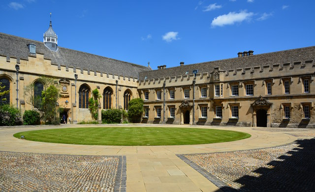
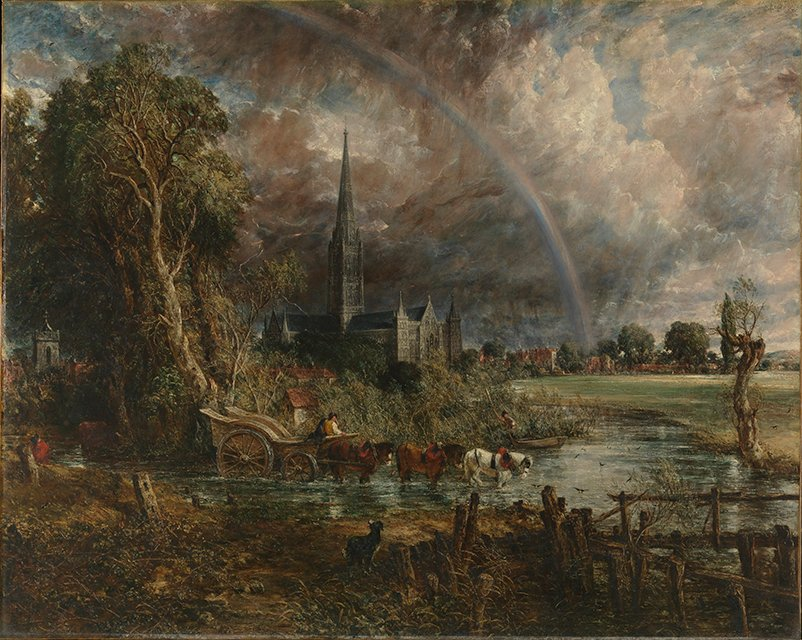
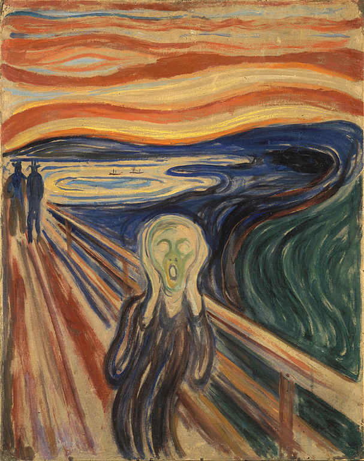

# TensorFlow Style Transfer with Batch Processing
Original repository [here](https://github.com/anishathalye/neural-style). Script added to perform multiple style transfer runs using different hyperparameters.

---

## Example

### Original Image

### John Constable

### Salvador Dali

### Edvard Munch

---
